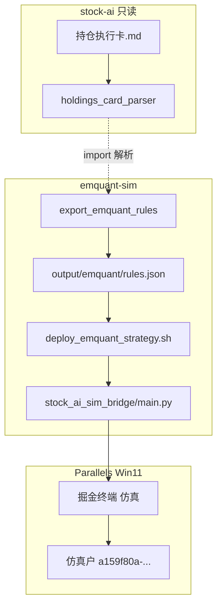

# 东财掘金仿真量化 — 运维手册（PLAYBOOK）

> **2026-06-02 下线**：`EMQUANT_ENABLED=0`，见 [OFFLINE.md](../OFFLINE.md)。下文保留备查。

> 子项目：`emquant-sim/` · 与 `stock-ai` **隔离运行**，只读执行卡。  
> 策略 ID 示例：`5aa6af16-5da8-11f1-996b-001c42c700fc`（以 `.env.emquant` 为准）

## 1. 架构与边界



| 维度 | stock-ai | emquant-sim / Win11 |
|------|----------|---------------------|
| 执行卡 | 权威来源、改卡、同步 MySQL/微信 | **只读**导出 `rules.json` |
| 持仓 | **东方财富证券** / `portfolio_positions` | **仅仿真户** `get_position()` |
| 减仓/止损 `holdings_rules` | 监控提醒（全卡标的） | **仅仿真持仓 ≥100 股** 才判+下单 |
| P-买 `buy_triggers` | 文档纪律 | 仿真可空仓触发（如皖能） |
| 综合选股 | `stock_selection_combined` 脚本 | `combined_selection_gm`（09:35 等） |
| Mac | OpenCLI 行情、scheduler | `probe_emquant` 仅测配置/端口 |

**不关联**：MySQL 持仓表、微信推送、stock-ai launchd、掘金不会在 Mac 上 `pip install gm`。

## 2. 环境

| 项 | 值 |
|----|-----|
| Mac 配置 | `emquant-sim/.env.emquant`（勿提交 git） |
| Win11 VM | Parallels `Windows 11` |
| 终端服务 | `EMQUANT_SERV_ADDR=10.211.55.8:7001`（Parallels IP，会变需改） |
| 策略目录 | `C:\Users\yolo\.emgm3\projects\<策略UUID>\` |
| Python | `C:\Program Files\Python312-x64\python.exe` |
| 终端日志 | `C:\Users\yolo\.emgm3\logs\<session>\main.log` |

## 3. 日常流程

### 3.1 改执行卡后（纪律/价位/股数）

```bash
cd /Users/yolo/dev/yolo/tools-workspace/emquant-sim
PYTHONPATH=. python3 -m scripts.tools.export_emquant_rules
./scripts/win/deploy_emquant_strategy.sh 5aa6af16-5da8-11f1-996b-001c42c700fc
```

Win11：**仿真** → 策略 **停止 → 再运行**（终端重启后**不会**自启策略）。

### 3.2 只改策略代码（不改卡）

```bash
./scripts/win/deploy_emquant_strategy.sh <策略UUID>
# 终端停止 → 再运行
```

### 3.3 Mac 侧健康检查

```bash
cd emquant-sim && PYTHONPATH=. python3 -m scripts.tools.probe_emquant
# 期望：Token/策略ID已填、TCP 7001 可达；gm import 失败在 Mac 上正常
```

### 3.5 龙头战法验证（游资轨）

情绪日检入库后（`sync_emotion_cycle` / scheduler 17:10）：

```bash
cd /Users/yolo/dev/yolo/tools-workspace/emquant-sim
PYTHONPATH=. python3 -m scripts.tools.export_emotion_dragons
./scripts/win/deploy_emquant_strategy.sh <策略UUID>
```

Win11 终端：**运行文件** 选 `dragon_main.py`（详见 [emquant-dragon-strategy.md](emquant-dragon-strategy.md)）。

### 3.4 从 Mac 读策略控制台（API）

```bash
# 在 Win11 内（prlctl exec），需 Bearer Token
curl -s -H "Authorization: Bearer <EMQUANT_TOKEN>" \
  "http://127.0.0.1:7002/v3/strategy-logs/<策略UUID>"
```

空 `{}` = Python 未跑或尚无 `print`。UI「Python 控制台」与 API 同源。

## 4. 策略逻辑摘要

| 模块 | 时机 | 说明 |
|------|------|------|
| `on_session` | 09:35 / 10:30 / 13:05 / 14:45 | 沪深300综合选股 → `rebalance`（偏离 <3% 不调） |
| `on_bar` 60s | 盘中 | `buy_triggers`：P-买条件满足可买 |
| `on_bar` 60s | 盘中 | `holdings_rules`：**仅** `held_volume(sym)>=100` |
| `fired_ids` | 每交易日 | 每条规则/买点触发一次即记入（避免无仓卖单刷屏） |

### 4.1 股数从哪来

| 来源 | 位置 |
|------|------|
| 执行卡文字 | `stock-ai/investment-agent/持仓执行卡.md`（如皖能「100～200」） |
| 仿真固定值 | `emquant-sim/scripts/tools/export_emquant_rules.py` → `BUY_TRIGGERS` / `TRADE_BY_ID` |
| 运行时 | `rules.json` → `execute_trade` → `_round_lot`（整手 100 倍数） |

示例（当前导出）：

| id | 股数 |
|----|------|
| `buy_wanneng` 皖能 | **200**（卡面区间上限） |
| `buy_youyou` 有友 | 100 |
| `buy_ccb` 建行 | 100 |
| 多数减仓规则 | 200 / 300 / 500 |

改股数：改 `export_emquant_rules.py` 中 `BUY_TRIGGERS` / `TRADE_BY_ID` → 重新导出部署。

## 5. 终端必做（首次 / 异常）

详见 [emquant-strategy-not-running.md](emquant-strategy-not-running.md)。

1. 经典版左下角 **量化** → **仿真**
2. 策略 **设置**：Python312-x64、`main.py`
3. **关联仿真资金账户**
4. **交易/运行** 启动（非仅「研究」）
5. 控制台应有：`[stock-ai] init ... (holdings_rules active on N symbols...)`

**真启动** 时 `main.log` 会出现 `PUT /v3/strategy-commands/<uuid>`；仅有 `GET strategy-logs` 无 PUT = 未启动。

## 6. 已踩坑与代码约定（2026-06-02）

| 现象 | 原因 | 处理 |
|------|------|------|
| `bar.get` TypeError | 掘金 bar 非 dict，`.get` 可能被占 | 用 `_bar_get(bar,'symbol')` / `bar['symbol']` |
| `cash is not defined` | `position_ratio_pct` 误写 `cash` 非 `cash_dict` | 已修 `holdings_rules_gm.py` |
| 无仓仍刷广州 `RULE` | 按卡订阅全标的；卖失败未记入 `fired_ids` | 仅持仓≥100 跑 `holdings_rules`；触发即 `fired_ids` |
| 界面「运行中」无日志 | 终端 08:58 重启后未再点运行 | 每日手动 **停止→运行** |
| 有 BUY_TRIGGER 无成交 | 限价单 @ bar 收盘价可能未成交 | 查仿真 **当日委托/成交** |
| 仿真无广州却想卖 | 规则来自执行卡全标的 | 已改为只看仿真持仓 |

## 7. 文件索引

| 路径 | 用途 |
|------|------|
| [emquant-sim-bridge.md](emquant-sim-bridge.md) | 策略两层逻辑 |
| [emquant-strategy-not-running.md](emquant-strategy-not-running.md) | 未运行排查 |
| `../scripts/tools/export_emquant_rules.py` | 执行卡 → rules.json |
| `../scripts/tools/probe_emquant.py` | Mac 配置/端口探测 |
| `../scripts/win/deploy_emquant_strategy.sh` | 部署到 Win11 |
| `../scripts/win/stock_ai_sim_bridge/main.py` | 策略入口 |
| `../config/emquant.env.example` | 环境变量模板 |
| `../.env.emquant` | 本地密钥（gitignore） |

## 8. 与 Hermes / Agent

- 改卡、导出、部署、看 Win11 日志：优先读本 PLAYBOOK + `emquant-sim/AGENTS.md`
- 持久记忆：`.cursor/rules/project-memory.mdc` 条目「东财掘金仿真 emquant-sim」
- **禁止**：在 `stock-ai` 下改掘金策略、`scripts/win/`、`.env.emquant`
