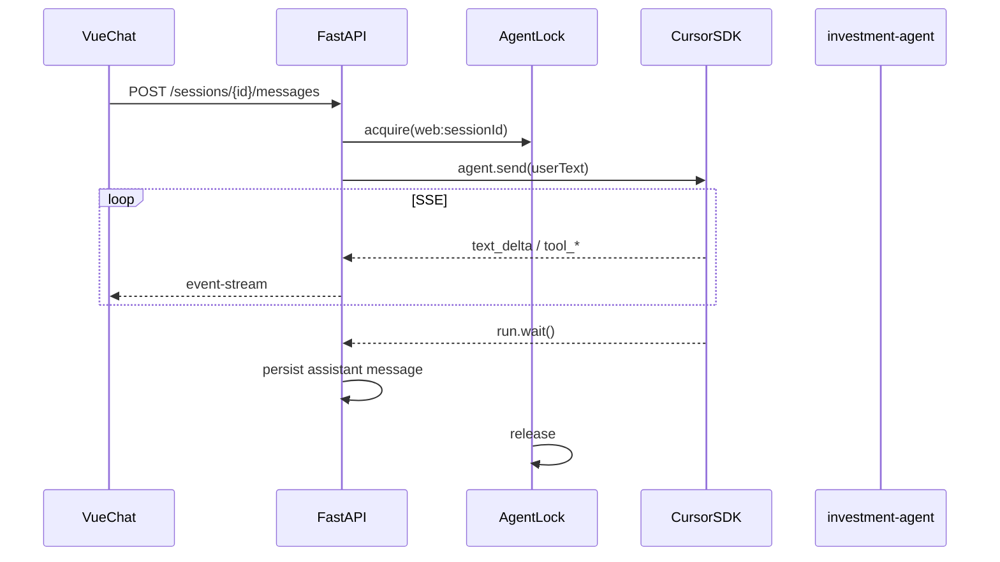

# 聊天机器人设计（Vue 3 + Cursor SDK）

## 目标

在浏览器中提供与 [wechat-cursor-acp](../../wechat-cursor-acp/) 类似的体验：多轮对话、流式输出、工作区 `investment-agent`（MEMORY / 执行卡 / 规则生效）。

## 组件

| 层 | 技术 | 职责 |
|----|------|------|
| 前端 | Vue 3 + Vite + TS | 会话列表、消息流、SSE 消费 |
| 后端 | FastAPI | REST + SSE、限流、可选 Token |
| Agent | **Cursor CLI** `agent acp`（`agent login`，同 wechat-acp） | 模型 `HUB_AGENT_MODEL`，cwd 指向 investment-agent |
| 存储 | SQLite `data/chat.db` | 会话 / 消息 / cursor_agent_id |

## 数据流



## SSE 事件

| event | 含义 |
|-------|------|
| `status` | 阶段提示（thinking） |
| `text_delta` | 助手正文增量 |
| `thinking_delta` | 思考过程（`HUB_FORWARD_THOUGHTS=1`） |
| `tool_start` / `tool_end` | 工具调用 |
| `done` | 本轮结束 |
| `error` | 含 `agent_busy` / `cursor_error` |

## 与微信桥差异

| 项 | 微信 wechat-acp | Web Chat |
|----|-----------------|----------|
| 传输 | 微信消息 | HTTPS + SSE |
| Agent 进程 | wechat-acp 子进程 `agent acp` | home-hub 长驻 `agent acp` + ACP client |
| 并发 | 微信单用户 | **全局互斥锁**（与微信不能同时跑 Run） |
| 会话 | wechat 会话 | SQLite + cursor_agent_id resume |

## 安全（公网前必读）

1. 仅 `127.0.0.1` 监听，经 Caddy 反代 + **Basic Auth**
2. 可选 `HUB_API_TOKEN` 二次校验
3. 聊天 rate limit 默认 10 条/分钟/IP

## 前端结构

```
frontend/src/
├── api/chat.ts          # REST + SSE 解析
├── types/chat.ts
├── views/ChatView.vue   # 主页面
└── components/chat/
    ├── ChatSidebar.vue
    └── MessageBubble.vue
```

## 后续

- [ ] Caddy `hub.yoloworld.site` + launchd
- [ ] 移动端侧栏折叠
- [ ] 消息 Markdown 渲染
- [ ] 与看板同壳（Vue Router 多页）
