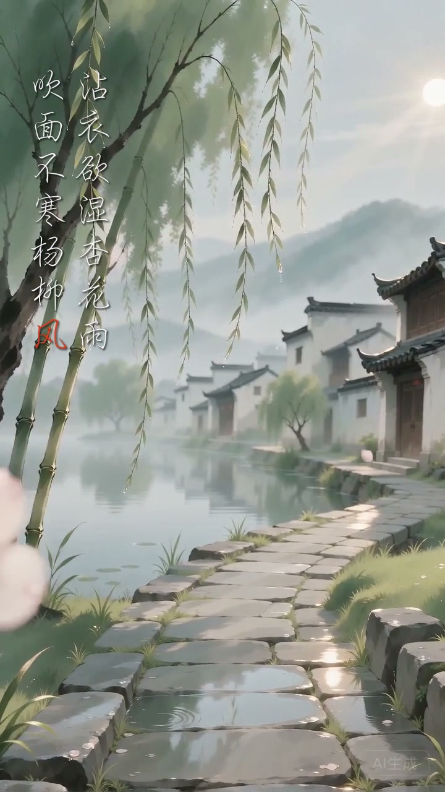
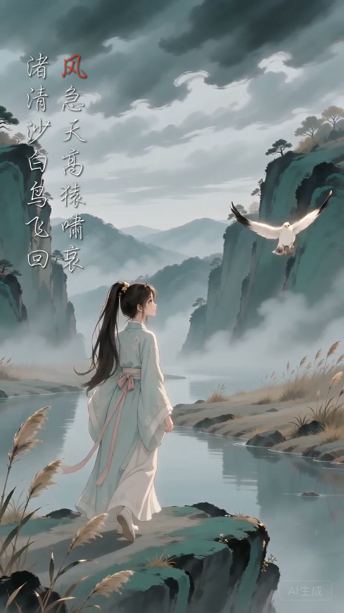

风看不见，栀夏和阿砚却想把它拍下来。

镜头里不能直接画出一阵风，于是他们去拍风经过以后留下的痕迹：柳条低下头，雨丝斜斜落在衣袖上；云层向后退，一张帆被慢慢撑满。

原来风从来不靠自己出现。

它借一片叶子、一页书、一个人的头发，让我们知道：它刚刚来过。

这也是栀夏与阿砚的飞花令，和普通诗词问答不太一样的地方。

阿砚不是蹲在画面边上卖萌的小宠物。它是一只从墨色里醒来的墨灵，会读诗，也会追问。它抛出一个字，像把一粒墨落进水里。

栀夏也不站在一旁解释标准答案。她接住诗句，走进诗里，看它怎样变成雨、山川、云海和人心。

**阿砚出题，栀夏接诗；汉字苏醒，诗境展开。**

这一次，他们从一个“风”字出发，走进了三种完全不同的诗境。

<!-- VIDEO_CARD: 飞花令·风 -->

第一阵风很轻。

“沾衣欲湿杏花雨，吹面不寒杨柳风。”

它从江南的小路上来，带着细雨和新绿。风没有催人赶路，只轻轻碰了一下衣襟。你甚至说不清它是什么时候来的，只觉得眼前的世界忽然柔软了。

第二阵风却陡然变急。

“风急天高猿啸哀，渚清沙白鸟飞回。”

江南的温柔退远了，栀夏走进秋江。天更高，水更冷，白鸟顶着风回旋。相同的一个“风”字，到了这里，不再只是景物，而像一个人无法说出口的苍凉。

然后，第三阵风把视线推向海面。

“长风破浪会有时，直挂云帆济沧海。”

帆升起来，船向前走，栀夏和阿砚终于在辽阔的海上同框。前一刻还让白鸟盘旋的风，此刻成了推船出发的力量。

**风没有固定的性格。人站在怎样的时刻，就会听见怎样的风。**

有人在春雨里听见温柔，有人在秋江上听见孤独，也有人隔着风浪，仍愿意相信船会抵达远方。

所以我们没有把这支短片做成三句诗的连续展示。

从杨柳到秋江，再到云帆，真正被串起来的，不只是三个画面，而是一个人面对世界时，心境怎样被风一点点打开。

片尾，书页又被吹动了一次。

阿砚没有宣布答案，也没有让飞花令在第三句结束。因为一场真正有意思的飞花令，不该只发生在栀夏和阿砚之间。

屏幕外的你，也是这场诗会的一部分。

**风停了，诗还没停。第四句，你来接。**

去视频号《飞花令·风》的评论区，留下一句你想到的、含有“风”的诗。栀夏和阿砚，在那里等你接令。
